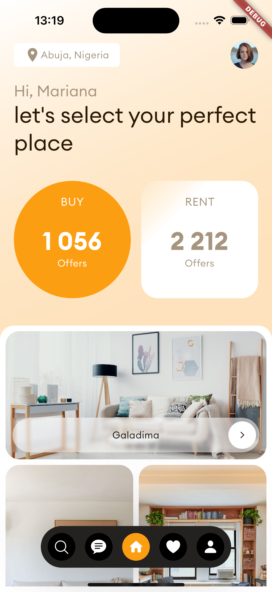
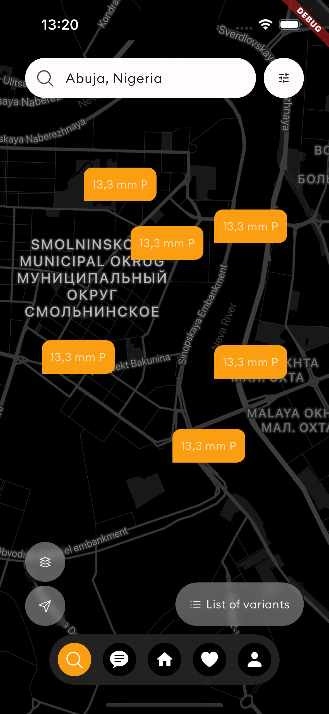

# Real Estate App

This is a Flutter-based real estate mobile application designed for TeamApt assessment,
design [here](https://dribbble.com/shots/23780608-Real-Estate-App)

## Screenshots

  
  

## Fonts

The font used in this app is [Euclid Circular A ](https://www.cdnfonts.com/euclid-circular-a.font) from Google Fonts.

## Assets

- All logos, avatars, and icons are sourced from the Material and Cupertino icon collections and other third-party sources to match the design.

## Animation

- The homepage animates when the app launches, providing a smooth transition to the main interface. However, this animations are not repeated when the Homepage come back to focus as shown towards the end of the provided video.

## Note

- The design and layout are inspired by the provided images and specifications.
- Efforts have been made to match the design as closely as possible, considering the limitations and differences in platform capabilities and available resources.
- The actual Google Maps implementation(hence the slight load up delay) attempts to show the same region as shown in the design.
- The app is provided as an APK file found [here](https://drive.google.com/file/d/1zT0KdzImCXvDVwTonqd8d7SE81rZ3Ima/view?usp=sharing) and the source code repository link is [here](https://github.com/Tamunorth/real-estate-dribble-recreation).

A few resources to get you started if this is your first Flutter project:

- [Lab: Write your first Flutter app](https://docs.flutter.dev/get-started/codelab)
- [Cookbook: Useful Flutter samples](https://docs.flutter.dev/cookbook)

For help getting started with Flutter development, view the
[online documentation](https://docs.flutter.dev/), which offers tutorials,
samples, guidance on mobile development, and a full API reference.
